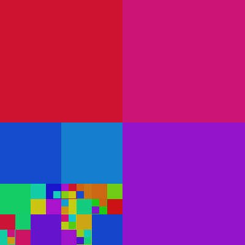
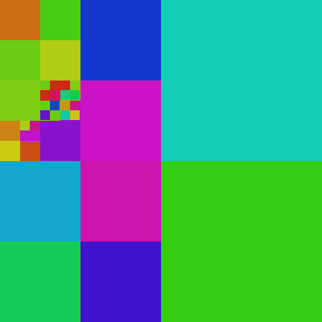
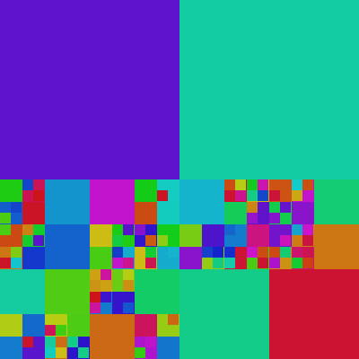

# java-9-modules-example

This is simple, modular java 9 application with three modules. 

Illustrates concepts described in [Prakryczny przykład - trzy moduły](https://kamilachyla.com/posts/java-9-praktyczny-przyklad-trzy-moduly/) blog post.

Generates images with specified width, height, file name and type or rectangle generator.
Requires Java 15 and a build with --enable-preview option (see Makefile).

```bash
java --enable-preview --module-path mlib -m guiclient/com.kamilachyla.guigen.ImageGenerator 400 400 out.png squares
```

Resulting images:



